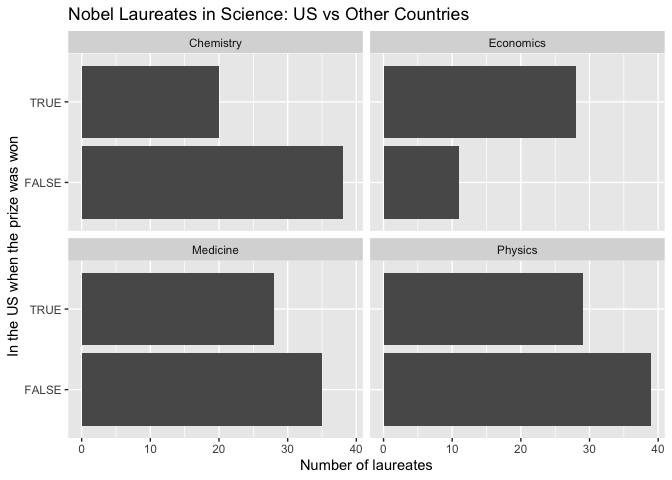
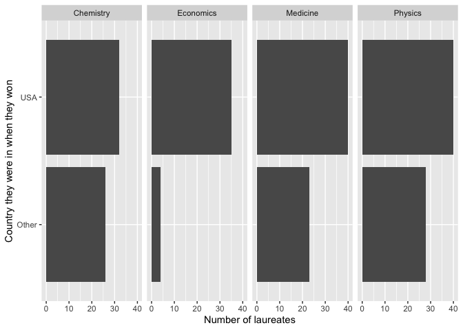

Lab 03 - Nobel laureates
================
Tiffani Hill
01/30/2026

### Load packages and data

``` r
library(tidyverse) 
library(skimr)
```

``` r
nobel <- read_csv("data/nobel.csv")
```

## Exercises

### Exercise 1

There are 935 observations, which as represented by rows. There are 26
variables.

``` r
skim(nobel)
```

|                                                  |       |
|:-------------------------------------------------|:------|
| Name                                             | nobel |
| Number of rows                                   | 935   |
| Number of columns                                | 26    |
| \_\_\_\_\_\_\_\_\_\_\_\_\_\_\_\_\_\_\_\_\_\_\_   |       |
| Column type frequency:                           |       |
| character                                        | 21    |
| Date                                             | 2     |
| numeric                                          | 3     |
| \_\_\_\_\_\_\_\_\_\_\_\_\_\_\_\_\_\_\_\_\_\_\_\_ |       |
| Group variables                                  | None  |

Data summary

**Variable type: character**

| skim_variable         | n_missing | complete_rate | min | max | empty | n_unique | whitespace |
|:----------------------|----------:|--------------:|----:|----:|------:|---------:|-----------:|
| firstname             |         0 |          1.00 |   2 |  59 |     0 |      720 |          0 |
| surname               |        29 |          0.97 |   2 |  26 |     0 |      851 |          0 |
| category              |         0 |          1.00 |   5 |  10 |     0 |        6 |          0 |
| affiliation           |       250 |          0.73 |   4 | 110 |     0 |      303 |          0 |
| city                  |       255 |          0.73 |   4 |  27 |     0 |      185 |          0 |
| country               |       254 |          0.73 |   3 |  14 |     0 |       27 |          0 |
| gender                |         0 |          1.00 |   3 |   6 |     0 |        3 |          0 |
| born_city             |        28 |          0.97 |   3 |  29 |     0 |      613 |          0 |
| born_country          |        28 |          0.97 |   3 |  28 |     0 |       80 |          0 |
| born_country_code     |        28 |          0.97 |   2 |   2 |     0 |       77 |          0 |
| died_city             |       327 |          0.65 |   4 |  29 |     0 |      303 |          0 |
| died_country          |       321 |          0.66 |   3 |  16 |     0 |       48 |          0 |
| died_country_code     |       321 |          0.66 |   2 |   2 |     0 |       46 |          0 |
| overall_motivation    |       918 |          0.02 |  55 | 114 |     0 |        7 |          0 |
| motivation            |         0 |          1.00 |  24 | 337 |     0 |      656 |          0 |
| born_country_original |        28 |          0.97 |   3 |  52 |     0 |      122 |          0 |
| born_city_original    |        28 |          0.97 |   3 |  36 |     0 |      616 |          0 |
| died_country_original |       321 |          0.66 |   3 |  35 |     0 |       52 |          0 |
| died_city_original    |       327 |          0.65 |   4 |  29 |     0 |      303 |          0 |
| city_original         |       255 |          0.73 |   4 |  27 |     0 |      185 |          0 |
| country_original      |       254 |          0.73 |   3 |  35 |     0 |       29 |          0 |

**Variable type: Date**

| skim_variable | n_missing | complete_rate | min | max | median | n_unique |
|:---|---:|---:|:---|:---|:---|---:|
| born_date | 33 | 0.96 | 1817-11-30 | 1997-07-12 | 1916-06-28 | 885 |
| died_date | 308 | 0.67 | 1903-11-01 | 2019-08-07 | 1983-03-09 | 616 |

**Variable type: numeric**

| skim_variable | n_missing | complete_rate | mean | sd | p0 | p25 | p50 | p75 | p100 | hist |
|:---|---:|---:|---:|---:|---:|---:|---:|---:|---:|:---|
| id | 0 | 1 | 475.12 | 277.83 | 1 | 234.5 | 470 | 716.5 | 969 | ▇▇▇▇▇ |
| year | 0 | 1 | 1970.44 | 33.30 | 1901 | 1947.0 | 1976 | 1999.0 | 2018 | ▃▃▅▆▇ |
| share | 0 | 1 | 1.99 | 0.94 | 1 | 1.0 | 2 | 3.0 | 4 | ▇▇▁▅▂ |

### Exercise 2

``` r
nobel_living <- nobel %>% 
  filter(
  is.na(died_date),
  !is.na(country),
  gender != "org"
  )
nrow(nobel_living)
```

    ## [1] 228

### Exercise 3

Most nobel prizes were won by individuals in the USA. The Buzzfeed
headline is partially supported by this data. This graph does not show
us where these individuals were born, but it does prove that most living
Nobel laureates in the sciences are based in the US.

``` r
nobel_living <- nobel_living %>% 
  mutate(
    country_us = if_else(country == "USA", "USA", "Other"
  ))
nobel_living_science <- nobel_living %>% 
  filter(category %in% c("Physics", "Medicine", "Chemistry", "Economics"))

library(dplyr)
library(ggplot2)

ggplot(nobel_living_science, aes(x = country_us)) +
  geom_bar() +
  facet_wrap(~ category) + 
  coord_flip() +
  labs (
    x = "In the US when the prize was won",
    y = "Number of laureates",
    title = "Nobel Laureates in Science: US vs Other Countries"
  ) +
  scale_x_discrete(labels = c("FALSE" = "Other", "TRUE" = "US"))
```

<!-- -->

### Exercise 4

105 winners were born in the US.

``` r
born_country_us <- nobel_living %>% 
  mutate(
    born_country_us = if_else(born_country == "USA", "USA", "Other")
  )
```

…

### Exercise 5

This diagram doesn’t appear to support Buzzfeed’s claim. Most people who
won a nobel peace prize in the US were born in the USA.

``` r
nobel_living <- nobel_living %>% 
  mutate(
    country_us = if_else(country == "USA", "USA", "Other"
  ))
nobel_living_science <- nobel_living %>% 
  filter(category %in% c("Physics", "Medicine", "Chemistry", "Economics"))

library(dplyr)
library(ggplot2)

ggplot(nobel_living_science, aes(x = country_us, fill = born_country_us)) +
  geom_bar() +
  facet_grid(~category) + 
  coord_flip() +
  labs(
    x = "Country they were in when they won",
    y = "Number of laureates"
    
  )
```

    ## Don't know how to automatically pick scale for object of type
    ## <tbl_df/tbl/data.frame>. Defaulting to continuous.

<!-- -->

### Exercise 6

Germany is the most common country.

``` r
nobel_living %>% 
  filter(country_us == "USA", born_country != "USA") %>% 
  count(born_country) %>%
  arrange(desc(n))
```

    ## # A tibble: 21 × 2
    ##    born_country       n
    ##    <chr>          <int>
    ##  1 Germany            7
    ##  2 United Kingdom     7
    ##  3 China              5
    ##  4 Canada             4
    ##  5 Japan              3
    ##  6 Australia          2
    ##  7 Israel             2
    ##  8 Norway             2
    ##  9 Austria            1
    ## 10 Finland            1
    ## # ℹ 11 more rows

…
